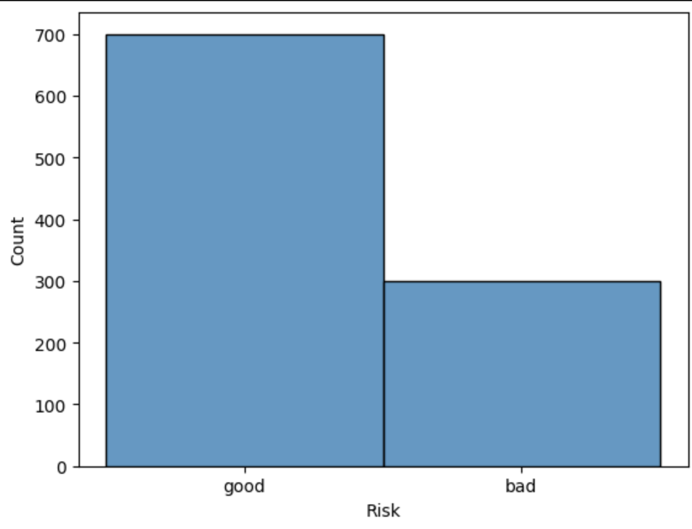
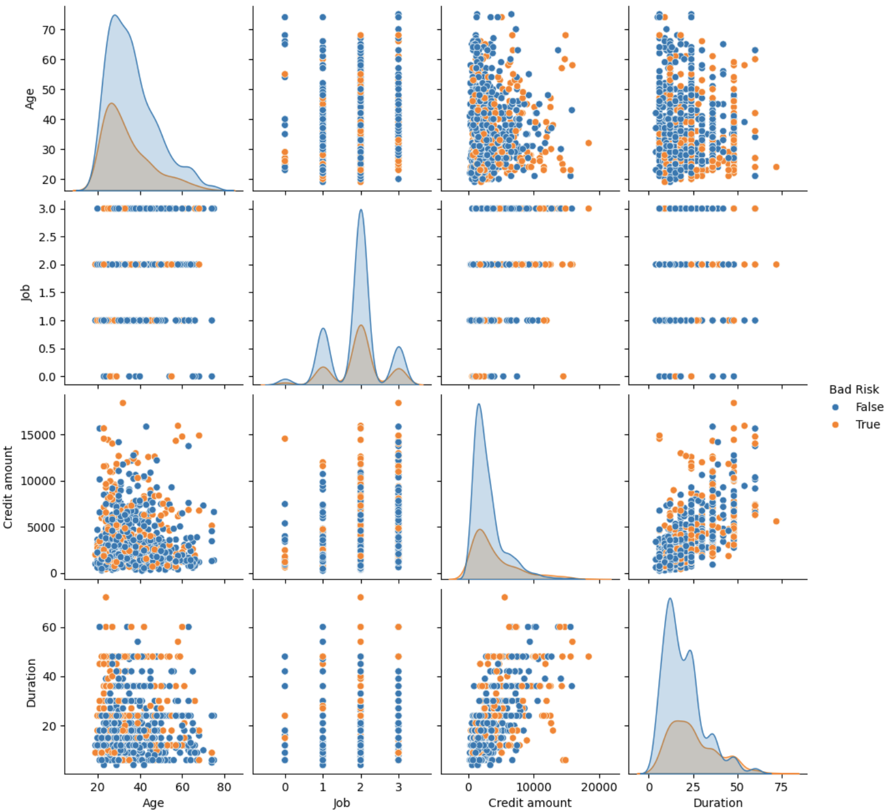
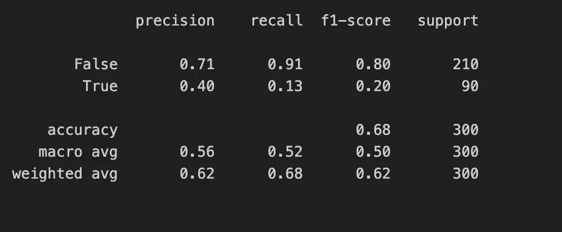
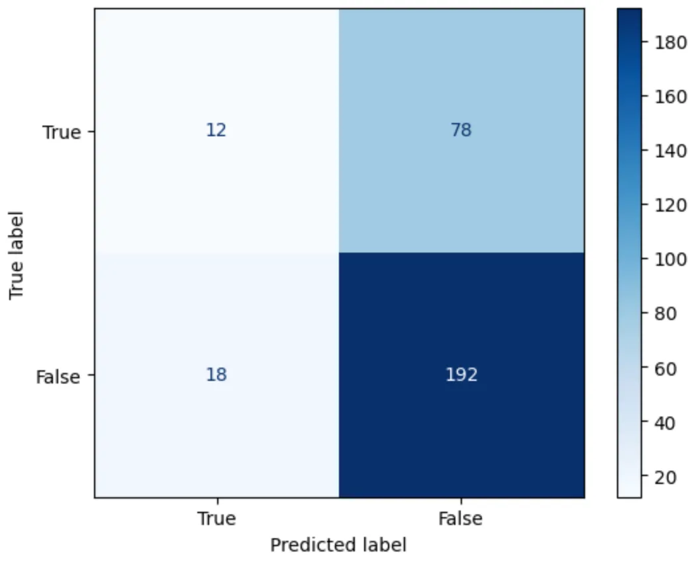

# German Credit Classification Project

## 🎯  Project Overview

The "German Credit Classification" project leverages Logistic Regression to predict credit risk for customers based on the **German Credit Data** dataset from Kaggle. The primary goal is to classify individuals into two categories: **Good Risk** (low risk) and **Bad Risk** (high risk), assisting financial institutions in making informed lending decisions.

The original dataset comprises 1,000 entries with 20 attributes. This project focuses on exploratory data analysis (EDA), data preprocessing, model training, and performance evaluation, utilizing techniques such as handling imbalanced data and K-Fold cross-validation to optimize results.

---

## Objectives

- Build an accurate credit risk prediction model using historical data.
- Address data imbalance to enhance prediction of the minority class (Bad Risk).
- Evaluate model performance using metrics like Precision, Recall, F1-Score, and Confusion Matrix.
- Compare Logistic Regression with K-Nearest Neighbors (KNN) to identify the optimal approach.

---

## Dataset

- **Source**: [German Credit Data on Kaggle](https://www.kaggle.com/datasets/uciml/german-credit)
- **Number of Records**: 1,000
- **Number of Features**: 10 (after preprocessing)
- **Feature Description**:
    
    
    | Column | Description | Data Type |
    | --- | --- | --- |
    | Age | Customer's age | Numeric |
    | Sex | Gender (male/female) | String |
    | Job | Job type (0-3) | Numeric |
    | Housing | Housing status | String |
    | Saving accounts | Savings account balance | String |
    | Checking account | Checking account balance | String |
    | Credit amount | Loan amount | Numeric |
    | Duration | Loan duration (months) | Numeric |
    | Purpose | Loan purpose | String |
    | Risk | Risk label (good/bad) | String |
- The target variable Risk is transformed into Bad Risk (True/False) for binary classification.

## Methodology

### 1. Exploratory Data Analysis (EDA)

The EDA phase provides insights into the dataset’s structure, distributions, and relationships, laying the foundation for preprocessing and modeling.

- **Dataset Overview**:
    - Loaded the dataset using pandas and inspected the first few rows (see cell execution_count=5 in the document).
    - Total records: 1,000, Columns: 10 (after preprocessing).
- **Class Distribution**:
    - **Good Risk**: 700 (70%)
    - **Bad Risk**: 300 (30%)
    - *Observation*: The dataset is imbalanced, with a significant skew toward Good Risk, which may bias the model toward majority class predictions.
- **Feature Distributions**:
    - **Age**: Ranges from 19 to 75, with a mean around 35 (suggests a relatively young population).
        - *Visualization*: Histogram of Age distribution
        
        
        
    - **Credit amount**: Varies widely (e.g., 804 to 7,882), indicating diverse loan sizes.
    - **Duration**: Ranges from 6 to 48 months, with longer durations potentially linked to higher risk.
    
    
    
- **Categorical Features**:
    - **Sex**: 690 males (69%), 310 females (31%).
    - **Housing**: Majority own (70%), followed by rent (18%) and free (12%).
    - **Purpose**: Common purposes include car (33%), radio/TV (28%), and furniture/equipment (18%).
- **Correlations**:
    - Positive correlation between Duration and Credit amount (longer loans tend to be larger).
    - Weak correlation between Age and Risk, suggesting age alone isn’t a strong predictor.
- **Key Insights**:
    - Imbalanced classes require special handling (e.g., class weighting).
    - Continuous features (Age, Credit amount, Duration) show variability that may benefit from normalization.

### 2. Data Preprocessing

- Converted Risk to Bad Risk (True if Risk = 'bad', False if Risk = 'good').
- Handled missing values in Saving accounts and Checking account (e.g., imputation or removal).
- Encoded categorical variables (Sex, Housing, Purpose) using One-Hot Encoding.

### 3. Modeling

- **Primary Model**: Logistic Regression
    - Parameters: penalty=None, class_weight='balanced'.
    - Data split: 70% train, 30% test.
- **Prediction**: Generated predictions on the test set.

### 4. Performance Evaluation

- **Classification Report**:
    
    
    
- **Confusion Matrix**:
    
    
    
    - **Interpretation**:
        - True Positives (TP): 43 (correctly predicted True).
        - False Positives (FP): 87 (False predicted as True).
        - True Negatives (TN): 123 (correctly predicted False).
        - False Negatives (FN): 47 (True predicted as False).
    - Low recall indicates difficulty in identifying all Bad Risk cases.

### 5. K-Fold Cross-Validation

- Applied **Stratified K-Fold** (5 folds, shuffle=True, random_state=2023).
- **Average Results**:
    
    
    | Metric | Mean | Std |
    | --- | --- | --- |
    | Precision | 0.384 | 0.042 |
    | Recall | 0.500 | 0.101 |
    | F1-Score | 0.432 | 0.063 |
- **Evaluation**: Stable performance (low standard deviation), but Recall varies significantly across folds.

### 6. Comparison with KNN

- **Model**: K-Nearest Neighbors (n_neighbors=10).
- **Average Results**:
    
    
    | Metric | Logistic Regression | KNN |
    | --- | --- | --- |
    | Precision | 0.384 | 0.528 |
    | Recall | 0.500 | 0.127 |
    | F1-Score | 0.432 | 0.202 |
- **Observation**: Logistic Regression outperforms KNN in Recall and F1-Score, making it better suited for detecting Bad Risk.

## Tools and Libraries

- **Language**: Python
- **Libraries**:
    - pandas: Data manipulation and analysis.
    - seaborn, matplotlib: Data visualization.
    - scikit-learn: Model building, evaluation, and cross-validation.
- **Environment**: Jupyter Notebook

## Results and Discussion

- **Performance**:
    - Logistic Regression with class_weight='balanced' improves Recall (0.48) for Bad Risk, but Precision remains low (0.33).
    - The Confusion Matrix highlights a bias toward predicting Good Risk due to data imbalance.
- **Limitations**:
    - Imbalanced data remains a challenge.
    - Continuous features like Credit amount and Duration were not normalized.
 
